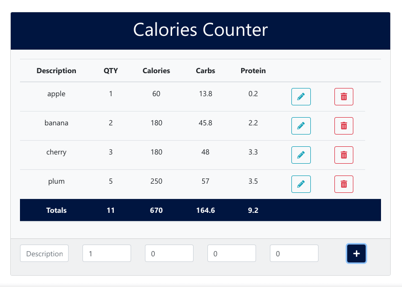
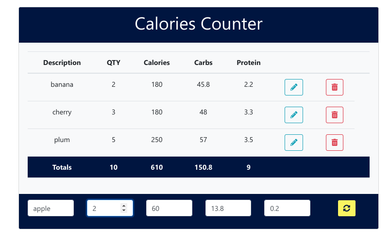

# Contador de Calorias con Programación Functional

Con esta aplicación podrás contar las calorías de tus comidas.

Ingresas los valores por porción o unidad y luego en qty la cantidad de porciones. La app te dará los totales

Incluye la función de editar y eliminar.




## VISÍTALA :point_right: [AQUÍ](https://GuadaMongeBarale.github.io/functional) :point_left:

---
--- 

##  Proceso y características destacadas

---

La **Programación Funcional** es un paradigma de programación. 

Persigue crear código  más conciso, legible y fácil de testear. 

Se centra en el *QUE* (declarativo) y no en el *cómo* (imperativo)

---

### Creación dinámica de etiquetas

---

Implementando funciones compuestas, dónde el resultado de cada función es el argumento de la siguiente, js crea las etiquetas HTML con sus respectivos atributos.

```javascript

const attrsToString = (obj = {}) =>
  Object.keys(obj)
  .map((attr)=> `${attr}="${obj[attr]}"`)
  .join('')

const tagAttrs = obj => (content = '') => 
`<${obj.tag} ${obj.attrs ? '' : ''}${attrsToString(obj.attrs)}> ${content} </${obj.tag}>`

const tag = t => typeof t === 'string' ? tagAttrs({tag: t }) : tagAttrs(t)

```

La **composición de funciones** otorga mayor legibilidad al código, ya que no estamos anidando funciones

```javascript
const compose = (...functions) => data =>
  functions.reduceRight((value, func) => func(value), data)

const tableRow = items => compose(tableRowTag, tableCells)(items)

```

Cuando el usuario ingresa un nuevo valor, las funciones crean el contenido a renderizar

```javascript
const renderItems = ()=> {
  tbody.innerHTML = ''
  list.map((item, index) => {

    const editBtn = tag({
      tag: 'button',
      attrs: {
        class: 'btn btn-outline-info',
        onclick: `editItem(${index})`,
        title: 'Edit'
      }
    })(editIcon)

    const removeBtn = tag({tag:'button', attrs:{
      class:'btn btn-outline-danger',
      onclick:`removeItem(${index})`
    }})(trashIcon)

    tbody.innerHTML +=tableRow([item.description, item.qty, item.calories, item.carbs, item.protein, editBtn, removeBtn])
  })
}
```

---

### Editar 

---



Si el usuario quiere modificar valores, puede hacerlo.

La función *editItem* copia el item en los inputs y modifica las clases de CSS para guiar visualmente.

```javascript

const editItem = (index) => {

  const item = {...list[index]}

  removeItem(index)

  footer.classList.add('edit')
  btn.classList.add('edit-btn')
  icon.classList.remove('fa-plus')
  icon.classList.add('fa-sync-alt')

  description.value = item.description
  qty.value = item.qty
  calories.value = item.calories
  carbs.value = item.carbs
  protein.value = item.protein
}

```

En el botón de actualizar se reutiliza la misma función que para crear nuevos items.

```javascript

const validateInputs = () => {

  description.value ? '' : description.classList.add('is-invalid')
  qty.value > 0 ? '' : qty.value = 1
  calories.value > 0 ? '' : calories.classList.add('is-invalid')
  carbs.value > 0 ? '' : carbs.classList.add('is-invalid')
  protein.value > 0 ? '' : protein.classList.add('is-invalid')
  
  if (description.value  && calories.value > 0  && carbs.value > 0 && protein.value > 0) {
    add();
  }
  // En caso de venir de EDITAR
  if (footer.className == 'card-footer edit') {
    footer.classList.remove('edit')
    btn.classList.remove('edit-btn')
    icon.classList.add('fa-plus')
    icon.classList.remove('fa-sync-alt')
  }
}
```

Puedes ver el código completo [aquí](js/main.js) 